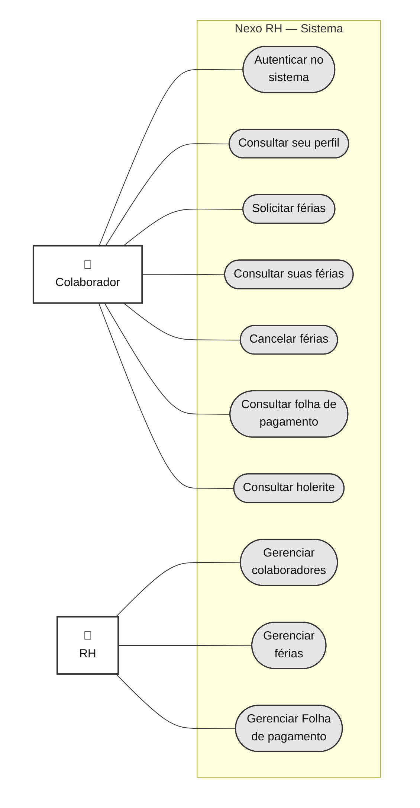
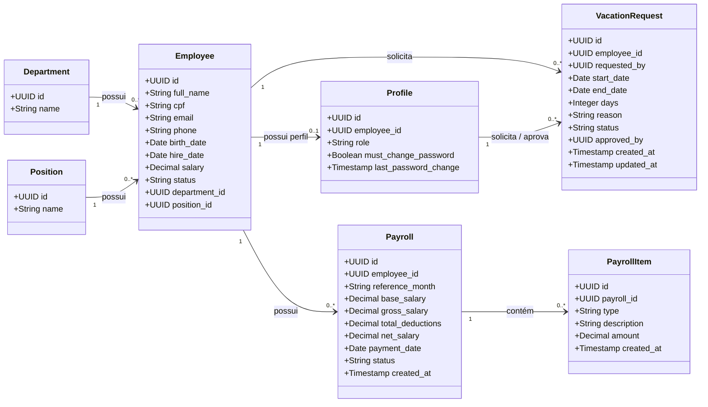
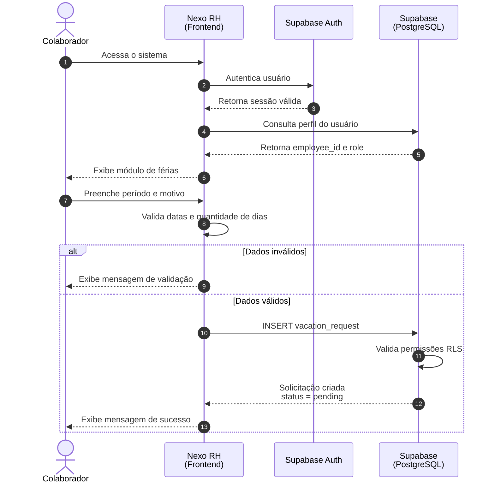
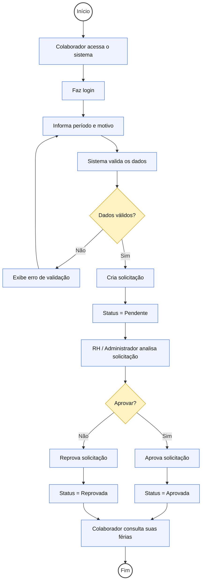
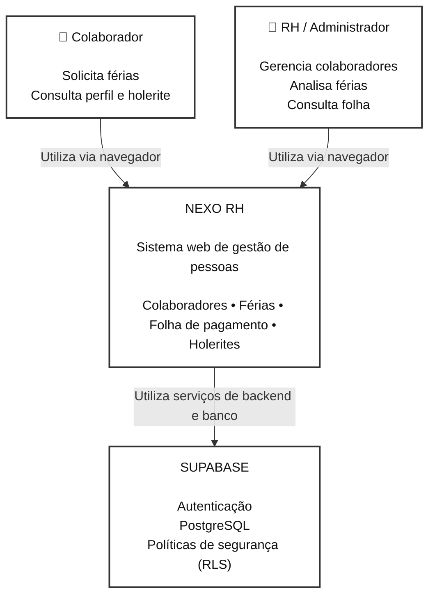
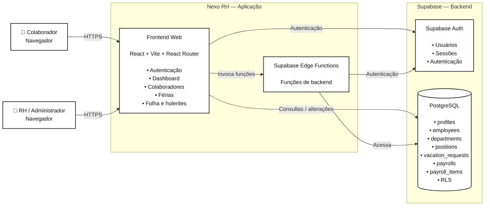

# Nexo RH — Diagramas UML e C4 Model

---

# 1. UML — Diagrama de Caso de Uso

# 2. UML — Diagrama de Classes

# 3. UML — Diagrama de Sequência

### Fluxo: solicitação de férias pelo colaborador

---

# 4. UML — Diagrama de Atividade

### Fluxo: solicitação e aprovação de férias

# 5. C4 Model — Diagrama de Contexto

# 6. C4 Model — Diagrama de Containers

